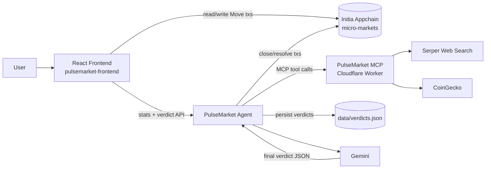
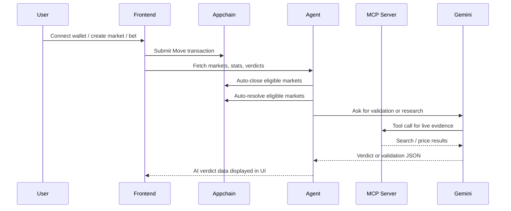
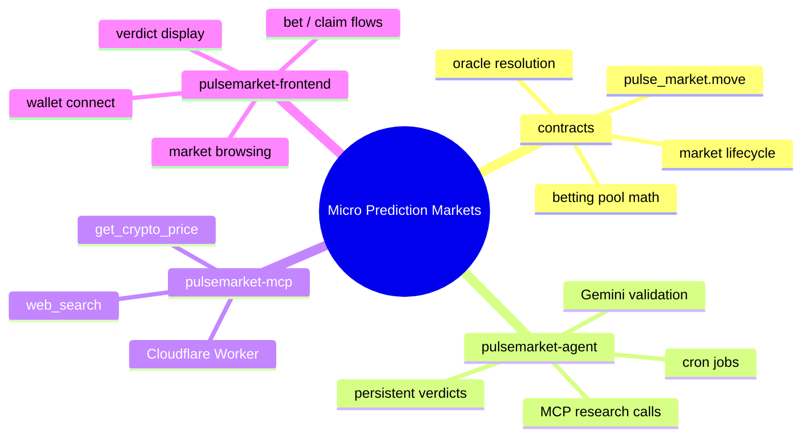

# Micro Prediction Markets

Micro Prediction Markets is a full-stack Initia appchain project that combines:

- An on-chain Move contract for market creation, betting, closure, and resolution.
- A backend agent that automates market lifecycle management and stores AI verdicts durably.
- A Cloudflare MCP server that gives Gemini real-time web and crypto evidence.
- A React frontend that lets users create markets, place bets, manage positions, and inspect AI verdicts.

The project is designed to show a complete production-style flow: wallet interaction, on-chain execution, off-chain orchestration, external evidence gathering, and explainable AI resolution.

## Submission Details

```json
{
  "project_name": "Micro Prediction Markets",
  "repo_url": "https://github.com/divin3circle/micro-prediction-markets",
  "commit_sha": "10a68d33104b2a8c8b7a64291030c4363416020e",
  "rollup_chain_id": "micro-markets",
  "deployed_address": "init1rrlffyalu47cwryh0lswluq8wuzktpdhzqvdwq",
  "vm": "move",
  "native_feature": "auto-signing",
  "core_logic_path": "contracts/sources/pulse_market.move",
  "native_feature_frontend_path": "pulsemarket-frontend/src/lib/pulseMarketApi.js",
  "demo_video_url": ""
}
```

## System Architecture



### Runtime Flow



### Project Topology



## Repository Layout

- `contracts/` - Move module, build artifacts, and contract-level documentation.
- `pulsemarket-agent/` - Express API, cron automation, Gemini orchestration, and persistent verdict storage.
- `pulsemarket-mcp/` - Cloudflare Worker MCP server for live evidence tools.
- `pulsemarket-frontend/` - Vite + React UI for users, positions, and AI verdicts.

## What Makes The Project Interesting

1. The contract enforces the economic and lifecycle rules on-chain.
2. The agent adds automation without taking custody of market state.
3. The MCP server isolates live-data tools from the rest of the app.
4. The frontend uses auto-signing and wallet-aware flows for smoother UX.
5. Verdicts are stored locally so research results survive restarts and can be audited.

## Local Setup

The project is easiest to run in four terminals.

### 1. Contracts

```bash
cd contracts
minitiad move build
minitiad move test
```

### 2. MCP Server

```bash
cd pulsemarket-mcp
pnpm install
pnpm run dev
```

### 3. Agent

```bash
cd pulsemarket-agent
pnpm install
pnpm run dev
```

### 4. Frontend

```bash
cd pulsemarket-frontend
pnpm install
pnpm run dev
```

## Environment Variables

### `pulsemarket-agent/.env`

Required values:

- `ORACLE_MNEMONIC`
- `GEMINI_API_KEY`
- `CHAIN_ID=micro-markets`
- `LCD_URL=http://localhost:1317`
- `TENDERMINT_RPC_URL=http://localhost:26657`
- `MODULE_ADDRESS=init1rrlffyalu47cwryh0lswluq8wuzktpdhzqvdwq`
- `MODULE_NAME=pulse_market`
- `FEE_DENOM=umin`
- `FRONTEND_ORIGIN=http://localhost:5173`
- `ADMIN_SECRET` (recommended)
- `MCP_SERVER_URL=https://pulsemarket-mcp.sylus-abel.workers.dev/mcp` or local equivalent

Optional values:

- `GEMINI_MODEL`
- `MARKET_MIN_CLOSE_LEAD_SECONDS`
- `MARKET_MAX_RESOLUTION_FUTURE_DAYS`
- `LOG_ERROR_STACK`
- `PORT`
- `ORACLE_COIN_TYPE`
- `ORACLE_ETH_DERIVATION`

### `pulsemarket-mcp/.dev.vars`

Required values:

- `SERPER_API_KEY`
- `COINGECKO_KEY` (optional but recommended)

### `pulsemarket-frontend/.env`

Required values:

- `VITE_CHAIN_ID=micro-markets`
- `VITE_RPC_URL=http://localhost:1317`
- `VITE_TENDERMINT_RPC_URL=http://localhost:26657`
- `VITE_MODULE_ADDRESS=init1rrlffyalu47cwryh0lswluq8wuzktpdhzqvdwq`
- `VITE_ORACLE_ADDRESS=init1rrlffyalu47cwryh0lswluq8wuzktpdhzqvdwq`
- `VITE_FEE_DENOM=umin`
- `VITE_AGENT_URL=http://localhost:3001`

Optional values:

- `VITE_L1_CHAIN_ID`
- `VITE_L1_LCD_URL`
- `VITE_L1_DENOM`
- `VITE_EXECUTOR_URL`
- `VITE_INDEXER_URL`
- `VITE_OP_BRIDGE_ID`
- `VITE_AGENT_SECRET`

## Key Documentation

- [pulsemarket-agent/README.md](pulsemarket-agent/README.md)
- [pulsemarket-mcp/README.md](pulsemarket-mcp/README.md)
- [pulsemarket-frontend/README.md](pulsemarket-frontend/README.md)
- [contracts/README.md](contracts/README.md)

## Notes For Judges

This codebase was organized to show the full stack of a modern on-chain prediction market:

- deterministic on-chain state transitions
- off-chain AI-assisted verification
- external evidence gathering with a dedicated MCP server
- persistent verdict storage and repeatable research
- wallet-native user flows in the frontend

The goal is not just a working demo, but a system that is explainable end-to-end.
