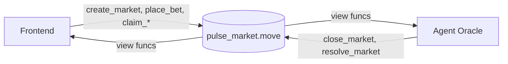
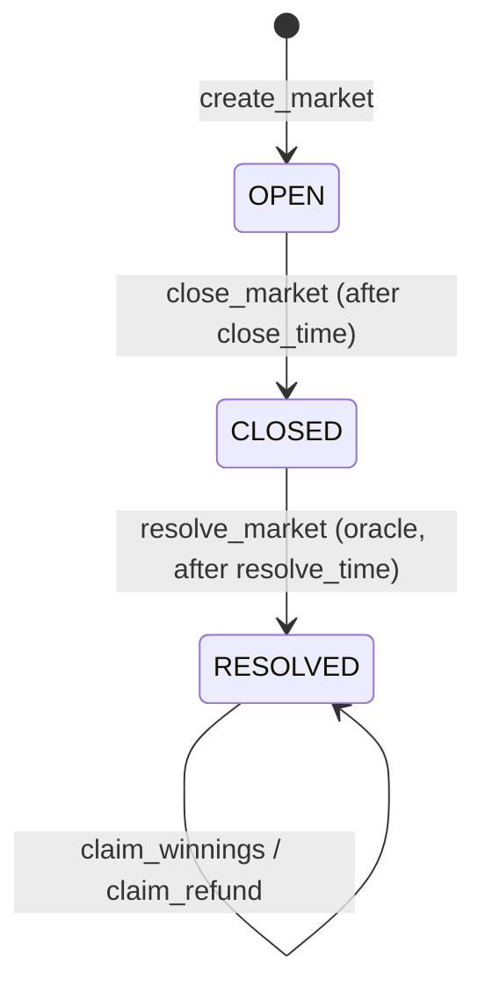

# PulseMarket Contracts

This folder contains the core on-chain Move module that powers market lifecycle, betting pools, payout logic, and oracle resolution.

## Deployed Contract

- Module address: `init1rrlffyalu47cwryh0lswluq8wuzktpdhzqvdwq`
- Module path: `init1rrlffyalu47cwryh0lswluq8wuzktpdhzqvdwq::pulse_market`
- Appchain explorer: https://scan.testnet.initia.xyz/micro-markets

## Role In The Full System



### On-Chain Lifecycle



## Contract Responsibilities

`sources/pulse_market.move` defines:

1. Market state (`OPEN`, `CLOSED`, `RESOLVED`) and outcomes (`YES`, `NO`).
2. Entry points:
   - `create_market`
   - `place_bet`
   - `close_market`
   - `resolve_market`
   - `claim_winnings`
   - `claim_refund`
3. Vaulted pool accounting + fee charging.
4. Access control for oracle-only resolution.
5. Events for market creation, betting, close, resolve, and claims.

## Local Setup

Prerequisite: Initia Move tooling (`minitiad`) installed.

1. Build contracts:

```bash
cd contracts
minitiad move build
```

2. Run Move tests:

```bash
minitiad move test
```

3. Publish (example flow, depends on your local key/config):

```bash
minitiad move publish --gas-budget 100000000
```

## Expected Environment Inputs

The Move package itself does not require runtime env vars, but deployment and app integration rely on these values:

| Name                                     | Used By        | Purpose                            |
| ---------------------------------------- | -------------- | ---------------------------------- |
| `CHAIN_ID`                               | Agent/Frontend | Target appchain id                 |
| `LCD_URL`                                | Agent/Frontend | Chain REST endpoint                |
| `TENDERMINT_RPC_URL`                     | Agent/Frontend | Chain RPC endpoint                 |
| `MODULE_ADDRESS` / `VITE_MODULE_ADDRESS` | Agent/Frontend | Published module address           |
| `MODULE_NAME`                            | Agent/Frontend | Move module name (`pulse_market`)  |
| `FEE_DENOM` / `VITE_FEE_DENOM`           | Agent/Frontend | Native denom for tx and accounting |

## Notes For Judges

- The contract enforces a strict lifecycle with timestamp guards.
- Oracle resolution is role-gated and auditable through emitted events.
- Off-chain AI is used for research only; final settlement still executes on-chain.
