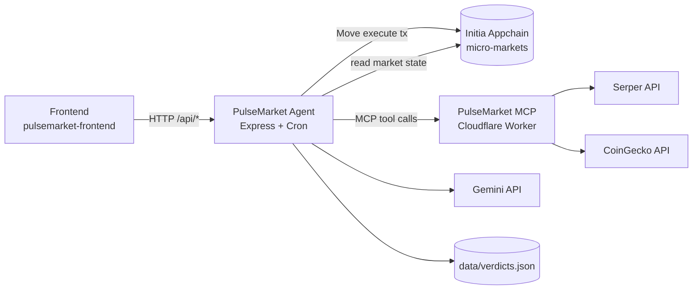
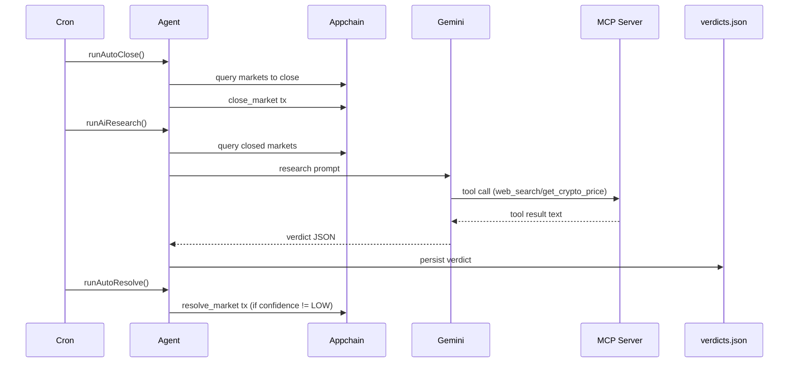

# PulseMarket Agent

This service is the off-chain automation and AI orchestration layer for PulseMarket.

It does four jobs:

1. Exposes backend APIs for the frontend (`/api/stats`, `/api/markets`, `/api/verdicts`, admin actions).
2. Runs cron jobs to close markets, research outcomes, and resolve eligible markets.
3. Calls Gemini + MCP tools to produce machine-readable verdicts.
4. Persists verdicts to local disk (`data/verdicts.json`) so restarts do not lose state.

## How This Folder Fits The Whole Project



### Runtime Flow



## Local Setup

1. Install dependencies:

```bash
pnpm install
```

2. Copy environment template:

```bash
cp .env.example .env
```

3. Start dev mode:

```bash
pnpm run dev
```

4. Optional force rerun for one market:

```bash
pnpm run rerun:research -- <marketId>
```

## Environment Variables

Expected variables (from `.env.example`):

| Variable                            | Required         | Purpose                                   |
| ----------------------------------- | ---------------- | ----------------------------------------- |
| `ORACLE_MNEMONIC`                   | Yes              | Oracle wallet seed phrase for tx signing  |
| `GEMINI_API_KEY`                    | Yes              | Gemini API access                         |
| `GEMINI_MODEL`                      | No               | Model ID, default `gemini-2.5-flash-lite` |
| `MARKET_MIN_CLOSE_LEAD_SECONDS`     | No               | Validation guard for close time           |
| `MARKET_MAX_RESOLUTION_FUTURE_DAYS` | No               | Validation guard for max future window    |
| `LOG_ERROR_STACK`                   | No               | Include stack traces in structured logs   |
| `ADMIN_SECRET`                      | Recommended      | Protect admin routes                      |
| `CHAIN_ID`                          | Yes              | Appchain ID (example: `micro-markets`)    |
| `LCD_URL`                           | Yes              | Chain LCD URL                             |
| `TENDERMINT_RPC_URL`                | Yes              | Tendermint RPC URL                        |
| `MODULE_ADDRESS`                    | Yes              | Deployed Move module address              |
| `MODULE_NAME`                       | Yes              | Move module name (`pulse_market`)         |
| `FEE_DENOM`                         | Yes              | Native denom (`umin`)                     |
| `PORT`                              | No               | API server port, default `3001`           |
| `FRONTEND_ORIGIN`                   | No               | CORS allow origin                         |
| `ORACLE_COIN_TYPE`                  | No               | Derivation coin type                      |
| `ORACLE_ETH_DERIVATION`             | No               | Use ETH derivation path (`true/false`)    |
| `MCP_SERVER_URL`                    | Yes for AI tools | MCP endpoint, include `/mcp`              |

## API Surface

- `GET /health`
- `GET /api/stats`
- `GET /api/markets`
- `GET /api/verdicts`
- `GET /api/verdicts/:id`
- `POST /api/research/:id` (admin)
- `POST /api/resolve/:id` (admin)
- `POST /api/validate-question`

## Note

- Persistent verdict storage avoids recomputation and preserves auditability.
- Auto-research is gated by `resolveTime` and retries low-confidence uncertain outcomes.
- The service cleanly separates on-chain execution, AI reasoning, and external data sourcing.
