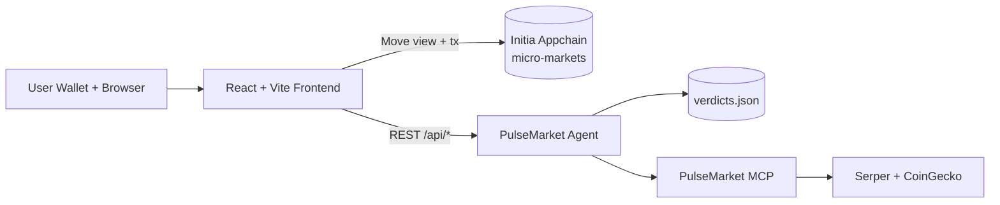
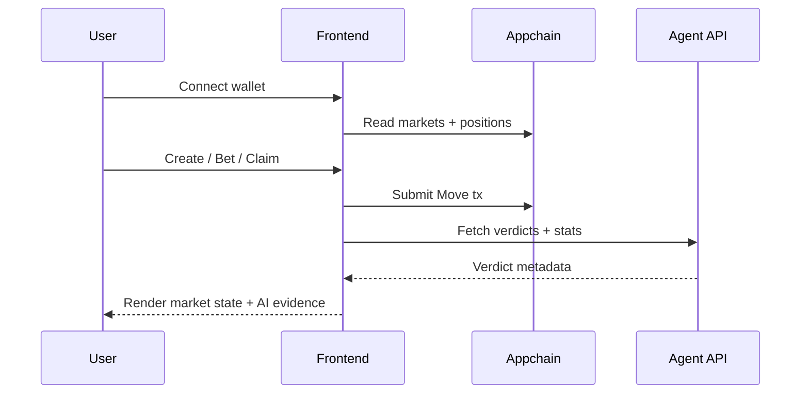

# PulseMarket Frontend

This is the user-facing web app for creating markets, placing bets, tracking positions, and viewing AI verdicts.

It integrates Initia InterwovenKit wallet flows, on-chain Move module views/txs, and backend agent APIs.

## Role In The Full System



### User Journey



## Local Setup

1. Install dependencies:

```bash
pnpm install
```

2. Create `.env` in this folder.

3. Start dev server:

```bash
pnpm run dev
```

## Expected Environment Variables

| Variable                  | Required                     | Purpose                              |
| ------------------------- | ---------------------------- | ------------------------------------ |
| `VITE_CHAIN_ID`           | Yes                          | Appchain id (`micro-markets`)        |
| `VITE_RPC_URL`            | Yes                          | Appchain LCD endpoint                |
| `VITE_TENDERMINT_RPC_URL` | Yes                          | Tendermint RPC endpoint              |
| `VITE_MODULE_ADDRESS`     | Yes                          | Deployed Move module address         |
| `VITE_ORACLE_ADDRESS`     | Yes                          | Oracle address used in UI context    |
| `VITE_FEE_DENOM`          | Yes                          | Chain fee denom (`umin`)             |
| `VITE_L1_CHAIN_ID`        | No                           | Defaults to `initiation-2`           |
| `VITE_L1_LCD_URL`         | No                           | L1 REST endpoint                     |
| `VITE_L1_DENOM`           | No                           | L1 denom (`uinit`)                   |
| `VITE_EXECUTOR_URL`       | No                           | Minitia executor metadata            |
| `VITE_INDEXER_URL`        | No                           | Indexer endpoint in chain metadata   |
| `VITE_OP_BRIDGE_ID`       | No                           | OP bridge id metadata                |
| `VITE_AGENT_URL`          | Yes for verdict/admin panels | Backend agent URL                    |
| `VITE_AGENT_SECRET`       | Recommended                  | Admin secret for protected endpoints |

## Key Components

- `src/pages/MarketsPage.jsx`: market listing + betting entry points.
- `src/components/MarketCard.jsx`: market display, pricing bars, and resolved verdict display.
- `src/components/PositionsView.jsx`: wallet positions and claim actions.
- `src/components/StatsView.jsx`: aggregate metrics + verdict explorer.
- `src/lib/pulseMarketApi.js`: Move module view/tx adapters.
- `src/lib/agentApi.js`: backend agent client.

## Note:

- The app demonstrates complete wallet-to-chain flow on Initia.
- It presents explainable AI verdict metadata directly in user views.
- It is designed for local appchain development and remote-agent integration.
