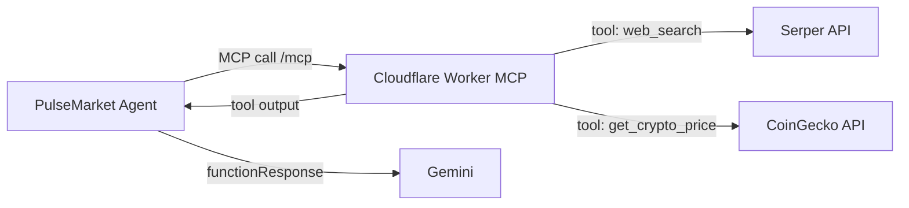
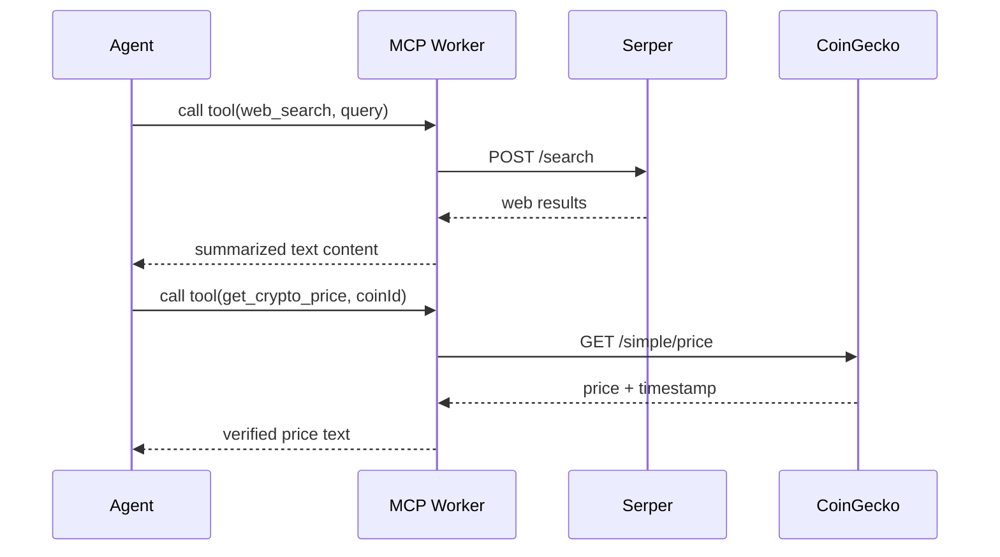

# PulseMarket MCP

This folder contains the dedicated MCP server used by the PulseMarket Agent for real-world evidence gathering.

It runs as a Cloudflare Worker and exposes tools that Gemini can call during market outcome research.

## Role In The Full System



### Tool Routing



## Exposed MCP Endpoint

- Base endpoint: `/mcp`
- Example local URL: `http://localhost:8787/mcp`
- Example deployed URL: `https://pulsemarket-mcp.sylus-abel.workers.dev/mcp`

## Local Setup

1. Install dependencies:

```bash
pnpm install
```

2. Configure local vars in `.dev.vars`.

3. Start local worker:

```bash
pnpm run dev
```

4. Deploy to Cloudflare:

```bash
pnpm run deploy
```

## Expected Environment Variables

Defined by `Env` in `src/index.ts`:

| Variable         | Required | Purpose                           |
| ---------------- | -------- | --------------------------------- |
| `SERPER_API_KEY` | Yes      | Web search API for current events |
| `COINGECKO_KEY`  | Optional | Higher-limit CoinGecko access     |

For production, set secrets using Wrangler:

```bash
wrangler secret put SERPER_API_KEY
wrangler secret put COINGECKO_KEY
```

## Implemented Tools

1. `web_search`

- Input: `query`
- Source: Serper
- Output: answer box + top organic results

2. `get_crypto_price`

- Input: `coinId` (CoinGecko id)
- Source: CoinGecko Simple Price API
- Output: USD price + last updated timestamp

## Note:

- MCP is isolated from chain execution for cleaner trust boundaries.
- Tool outputs are explicit and source-attributed.
- Worker endpoint is production-ready and reusable for other AI agents.
